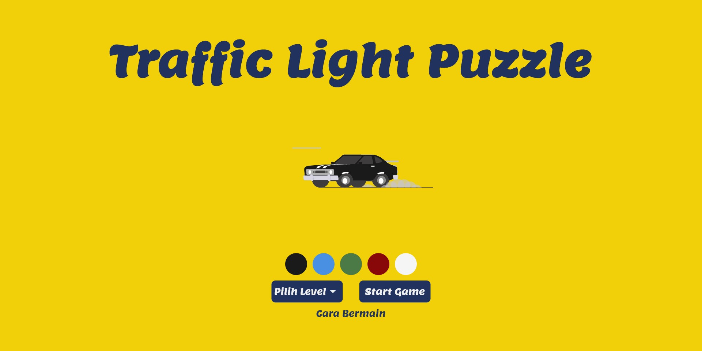

# TRAFFIC LIGHT PUZZLE 

Traffic Light Puzzle is a puzzle game that trains the user's logic to match the colors of a series of connected traffic lights with a certain time limit.

Developed using these technologies below  

 &nbsp; &nbsp; &nbsp; &nbsp;
 &nbsp; &nbsp; &nbsp; &nbsp;
 &nbsp; &nbsp; &nbsp; &nbsp;

 

<h2><blockquote> <b> Features </b></blockquote></h2>

1. Select Level
     
Fitur ini berguna untuk memilih level yang sesuai dengan keamampuan penguna. semaikin tinggi level yang dipilih maka semakin sulit pula puzzle diselesaikan 

4. Guideline
     
Di dalam game ini kamu akan menemukan fitur guideline yang dicipkatan dengan maksud membantu pengguna untuk memainkannya

2. Choose car's color
     
Dicipkatannya fitur ini sengaja untuk memberikan kesempatan pada pengguna mengcostumisasi warna mobil sesuai dengan warna favorit mereka.

3. Timer
     
Tak kalah pentingnya, fitur ini membentu pengguna untuk mngetahui berapa lama lagi waktu yang tersisa untuk mereka mengerjakan satu level puzzle sekaligus menjadi tantangan bagi pengguna untuk menyelesaikan game dengan secepat-cepatnya dengan logika yang tepat pula. 

 

<h2><blockquote> <b> How to play </b></blockquote></h2>
Cara memainkan Traffic Light Puzzle terbilang mudah, kamu hanya tinggal mengikuti langkah berikut   

<table>
     <tr>
          <td>1. Pilih level kesulitan puzzle yang ingin kamu mainkan</td>
          <td>2. Pilih warna mobil yang kamu inginkan (opsional)</td>
     </tr>
     <tr>
          <td></td>
          <td></td>
     </tr>
     <tr>
          <td>3. Tekan tombol start untuk memulai permainan</td>
          <td>4. Samakanlah semua lampu menjadi warna hijau dengan cara menekan-nekan masing-masing gambar lampu lalu lintas untuk mengubah warnanya. perhatikan pula waktu yang terus bergerak mundur </td>
     </tr>
     <tr>
          <td></td>
          <td></td>
     </tr>
     
</table>

Untuk mengetahui lebih jelas lagi, silakan tonton video demo di bawah ini 

https://user-images.githubusercontent.com/85988238/154833892-34831faf-d554-4449-902a-d27b08d32930.mp4

## Lets play
(link)

