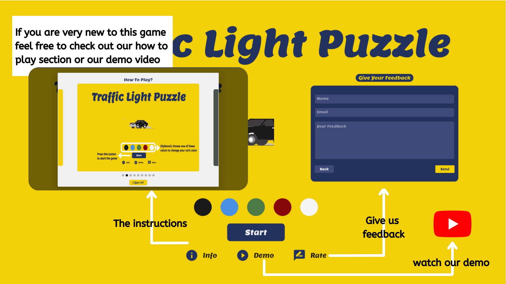
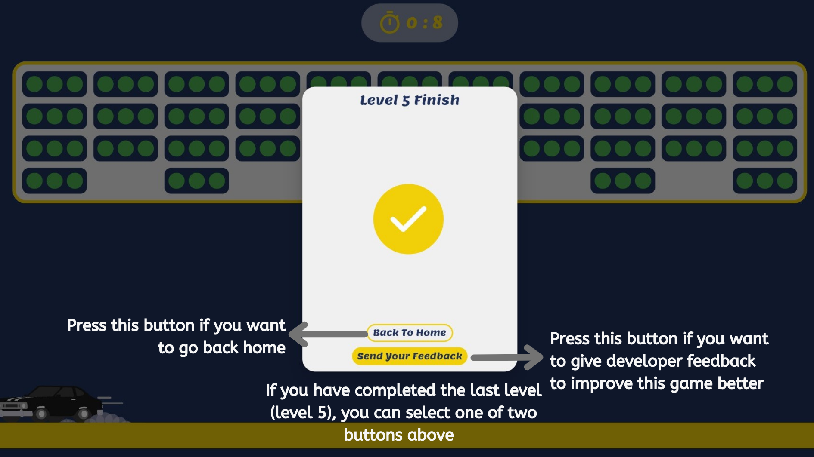

# TRAFFIC LIGHT PUZZLE 

Traffic Light Puzzle is a puzzle game that trains the user's logic to match the colors of a series of connected traffic lights with a certain time limit.

Developed using these technologies below  

 &nbsp; &nbsp; &nbsp; &nbsp;
 &nbsp; &nbsp; &nbsp; &nbsp;
 &nbsp; &nbsp; &nbsp; &nbsp;
 &nbsp; &nbsp; &nbsp; &nbsp;

 

<h2><blockquote> <b> Features </b></blockquote></h2>

1. Select Level
     
This feature is useful for selecting the level that suits the user's abilities. The higher the selected level, the more difficult the puzzle will be solved. 

4. Guideline
     
In this game, you will find guideline feature was made to explain to users how to play this game.

2. Choose car's color
     
This feature was created intentionally to give users the opportunity to customize the color of the car according to their favorite color.

3. Timer
     
Equally important, this feature helps users to know how much time is left to finish one puzzle level, as well as is a challenge for users to complete the game quickly with the right logic. 

 

<h2><blockquote> <b> How to play </b></blockquote></h2>

<table>
     <tr>
          <td>1. This home screen show you all features of this game. If you want to play this game follow the next steps</td>
          <td>2. You can Choose the car's color you want (optional) and press strat button to play the game </td>
     </tr>
     <tr>
          <td></td>
          <td></td>
     </tr>
     <tr>
          <td>3. Match all the lights to green by tapping on each traffic light image to change its color. also, pay attention to the time that keeps moving backward</td>
          <td>4. After finish all levels, feel free to give us a feedback </td>
     </tr>
     <tr>
          <td></td>
          <td></td>
     </tr>
     
</table>

To find out more clearly, please watch the demo video below! 

https://www.youtube.com/watch?v=6C_p7a_pCNo&feature=youtu.be

## Lets play
https://traffic-light-puzzle.web.app/#/Home

